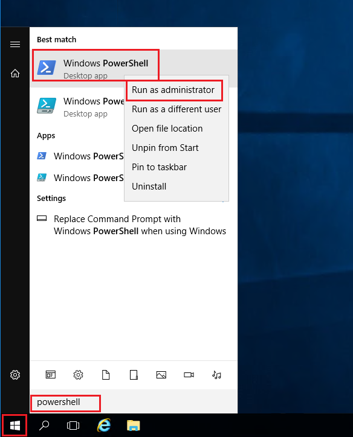

---
wts:
    title: '01 - Create a virtual machine in the portal (10 min)'   
    module: 'Module 02 - Core Azure Services (Workloads)'
---
# 01 - Create a virtual machine in the portal (10 min)

In this walkthrough, we will create a virtual machine in the Azure portal, connect to the virtual machine, install the web server role and test. 

**Note**: Take time during this walk-through to click and read the Informational icons. 

# Task 1: Create the virtual machine 
1. Sign-in to the Azure portal: **https://portal.azure.com**

3. From the **All services** blade in the Portal Menu, search for and select **Virtual machines**, and then click **+Create** and choose **+Azure Virtual machine** from the drop down.

4. On the **Basics** tab, fill in the following information (leave the defaults for everything else):

    | Settings | Values |
    |  -- | -- |
    | Subscription | **Use default supplied** |
    | Resource group | **Create new resource group** |
    | Virtual machine name | **myVM** |
    | Region | **(US) East US**|
    | Availability options | No infrastructure redundancy options required|
    | Image | **Windows Server 2019 Datacenter - Gen2**|
    | Size | **Standard D2s v3**|
    | Administrator account username | **azureuser** |
    | Administrator account password (type in carefully!) | **Pa$$w0rd1234**|
    | Inbound port rules - | **Allow select ports **|
    | Select inbound ports | **RDP (3389)** and **HTTP (80)**| 

5. Switch to the Networking tab to ensure **HTTP (80) and RDP (3389)** are selected in section **Select inbound ports**.

6. Switch to the Management tab, and in its **Monitoring** section, select the following setting:

    | Settings | Values |
    | -- | -- |
    | Boot diagnostics | **Disable**|

7. Leave the remaining values on the defaults and then click the **Review + create** button at the bottom of the page.

8. Once Validation is passed click the **Create** button. It can take anywhere from five to seven minutes to deploy the virtual machine.

9. You will receive updates on the deployment page and via the **Notifications** area (the bell icon in the top menu bar).

# Task 2: Connect to the virtual machine

In this task, we will connect to our new virtual machine using RDP (Remote Desktop Protocol). 

1. Click on bell icon from the upper blue toolbar, and select 'Go to resource' when your deployment has succeded. 

    **Note**: You could also use the **Go to resource** link on the deployment page 

2. On the virtual machine **Overview** blade, click **Connect** button and choose **RDP** from the drop down.

    

    **Note**: The following directions tell you how to connect to your VM from a Windows computer. On a Mac, you need an RDP client such as this Remote Desktop Client from the Mac App Store and on a Linux computer you can use an open source RDP client.

2. On the **Connect to virtual machine** page, keep the default options to connect with the public IP address over port 3389 and click **Download RDP File**. A file will download on the bottom left of your screen.

3. **Open** the downloaded RDP file (located on the bottom left of your lab machine) and click **Connect** when prompted. 

    

4. In the **Windows Security** window, sign in using the Admin Credentials you used when creating your VM **azureuser** and the password **Pa$$w0rd1234**. 

5. You may receive a warning certificate during the sign-in process. Click **Yes** or to create the connection and connect to your deployed VM. You should connect successfully.

    

A new Virtual Machine (myVM) will launch inside your Lab. Close the Server Manager and dashboard windows that pop up (click "x" at top right). You should see the blue background of your virtual machine. **Congratulations!** You have deployed and connected to a Virtual Machine running Windows Server. 

# Task 3: Install the web server role and test

In this task, install the Web Server role on the server on the Virtual Machine you just created and ensure the default IIS welcome page will be displayed. 

1. In the newly opened virtual machine, launch PowerShell by searching **PowerShell** in the search bar, when found right click **Windows PowerShell** to **Run as administrator**.

    

2. In PowerShell, install the **Web-Server** feature on the virtual machine by running the following command. (Paste in the command and hit ENTER for the installment to begin).

    ```PowerShell
    Install-WindowsFeature -name Web-Server -IncludeManagementTools
    ```
  
3. When completed, a prompt will state **Success** with a value **True**. You do not need to restart the virtual machine to complete the installation. Close the RDP connection to the VM by clicking the **x** on the blue bar at the top center of your virtual machine. You can also minimize it by clicking the **-** on the blue bar at the top center.

    

4. Back in the portal, navigate back to the **Overview** blade of myVM and, use the **Click to clipboard** button to copy the public IP address of myVM, then open a new browser tab, paste the public IP address into the URL text box, and press the **Enter** key to browse to it.

    

5. The default IIS Web Server welcome page will be displayed.

    

**Congratulations!** You have created a new VM running a web server that is accessible via its public IP address. If you had a web application to host, you could deploy application files to the virtual machine and host them for public access on the deployed virtual machine.


**Note**: To avoid additional costs, you can optionally remove this resource group. Search for resource groups, click your resource group, and then click **Delete resource group**. Verify the name of the resource group and then click **Delete**. Monitor the **Notifications** to see verify that the deletion completed successfully. 
