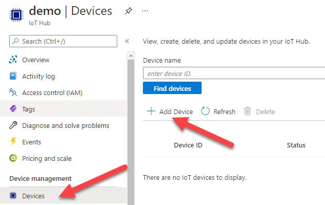
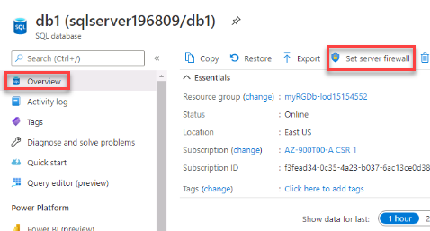

---
wts:
    title: '06 - Implement an Azure IoT Hub'
    module: 'Module 02 - Core Azure Services'
---

In this walkthrough, we will configure a new Azure IoT Hub in Azure Portal, and then authenticate a connection to an IoT device using the online Raspberry Pi device simulator. Sensor data and messages are passed from the Raspberry Pi simulator to your Azure IoT Hub, and you view metrics for the messaging activity in Azure Portal.

Estimated time: 30 minutes

**Task 1: Create an IoT hub**

In this task, we will create an IoT hub. 

1. Sign in to the [Azure portal](https://portal.azure.com).

2. Search for and select **IoT Hub** and then click **+Add**.

3. Fill in the fields with the following details.

	| Settings | Value |
	|--|--|
	| Subscription | **Choose your subscription** |
	| Resource Group |  **myRGIoT** (create new)|
	| Region | **East US** |
	| IoT Hub Name | **my-hub-group** |

4. Move to the **Size and scale** tab, use the dropdown list to set the **Pricing and scale tier** to **F1 - Free tier**. Notice you will have a fixed number of messages per day. 

5. Click the **Review + create** button.

6. Click the **Create** button to begin creating your new Azure IoT Hub.

7. Wait until your resource is deployed. 

**Task 2: Add an IoT device**

In this task, we will add an IoT device to the IoT hub. 

1. When the deployment has completed, choose **Go to resource** from the **Notifications** page. Or you can search for **IoT Hub** to locate your new resource.

	

2. To add a new IoT device, select **Explorers** > **IoT Devices** from the **IoT Hub navigation** blade. Then, choose the **New** button.

	

3. Provide a name for your new IoT device, **myRaspberryPi**, and click the **Save** button. This will create a new IoT device identity in your Azure IoT Hub.

4. If you do not see your new device, **Refresh** the IoT Devices page. 

5. Select **myRaspberryPi** and copy the **Primary Connection String** value. You will use this key in the next task to authenticate a connection to the Raspberry Pi simulator.

	

**Task 3: Test the device using the Raspberry Pi Simulator**

In this task, we will test our device using the Raspberry Pi Simulator. 

1. In a web browser, open the [online Raspberry Pi simulator](https://azure-samples.github.io/raspberry-pi-web-simulator/#Getstarted). 

2. Read about the Raspberry Pi simulator. If there is an overview pop-up select "**X**" to close the window.

3. In the coding area, right side, locate the line with 'const connectionString ='. Change the DeviceId and use your Primary connection sting.

	DeviceId=**myRaspberryPi**

	SharedAccessKey=**primary connection string**

	

4. Select **Run** (bottom pane) to run the application. The console output should show the sensor data and messages that are sent from the Raspberry Pi simulator to your Azure IoT Hub. Data and messages are sent each time the Raspberry Pi simulator LED flashes. 

	

5. Select **Stop** to stop sending data.

6. Return to the Azure portal and your IoT Hub.

7. Select the IoT Hub **Overview** blade and scroll down to the **IoT Hub Usage** information.

	

Congratulations! You have set up Azure IoT Hub to collect sensor data from an IoT device.

**Note**: To avoid additional costs, you can remove this resource group. Search for resource groups, click your resource group, and then click **Delete resource group**. Verify the name of the resource group and then click **Delete**. Monitor the **Notifications** to see how the delete is proceeding.