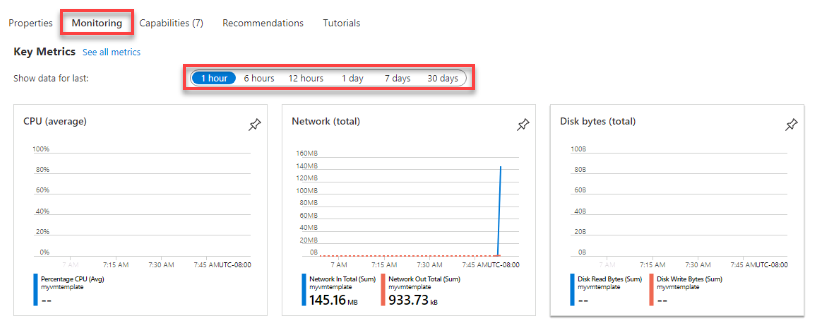

---
wts:
    title: '09 - Create a VM with a Template'
    module: 'Module 02 - Core Azure Services'
---

In this walkthrough, we will deploy a virtual machine with a QuickStart template and examine monitoring capabilities.

Estimated time: 30 minutes

**Task1: Explore the gallery and locate a template**

In this task, we will browse the Azure QuickStart gallery and deploy a template to create a virtual machine. 

1. In a browser, access the [Azure Quickstart Templates gallery](https://azure.microsoft.com/resources/templates?azure-portal=true). In the gallery you will find a number of popular and recently updated templates. These templates work with both Azure resources and popular software packages.

2. Browse through the many different types of templates that are available. Are there are any templates that are of interest to you?

3. Search for or directly access the [Deploy a simple Windows VM](https://azure.microsoft.com/resources/templates/101-vm-simple-windows?azure-portal=true) template.

    **Note**: The **Deploy to Azure** button enables you to deploy the template directly to the Azure portal. Notice this template only prompts you for small set of configuration parameters. 

4. Click the **Deploy to Azure** button. 

5. Click **Edit template**. The Resource Manager template format is JSON. Look through the parameters and locate the virtual machine name. Change the name to **myVMTemplate**. **Save** your changes.

    

6. Configure the template parameters. 

	| Setting| Value|
	|----|----|
	| Subscription | **Choose your subscription**|
	| Resource group | **myRGTemplate** (create new) |
    | Admin username | **azureuser** |
    | Admin password | **Pa$$w0rd1234** |
    | DNS label prefix | **myvmtemplatexxx** (this must be unique) |
    | Windows OS version | **2016-Datacenter** |

7. Check the box **I agree to the terms and conditions stated above.** and then click **Purchase**.

    **Note**: There is no cost associated with this template.

8. Monitor your deployment. 

**Task 2: Verify and monitor your virtual machine deployment**

In this task, we will verify the virtual machine deployed correctly. 

1. Search for and select **Virtual machines**.

2. Ensure your new virtual machine was created. 

    

3. Select your virtual machine and on the **Overview** pane scroll down to view monitoring data.

4. Notice the timeframe can be adjusted from one hour to 30 days.

5. Notice the different graphics that are provided including **CPU (average)**, **Network (total)**, and **Disk bytes (total)**. 

    

6. Click on any graphic. Notice you **Add metric** and change the chart type. As you have time, experiment. 

7. Return to the **Overview** blade.

8. Click on the **Activity log** (left pane). Activity logs record when resources are created or modified. 

11. Click **Add filter**, and experiment with searching for different event types and operations. 

    

**Note**: To avoid additional costs, you can remove this resource group. Search for resource groups, click your resource group, and then click **Delete resource group**. Verify the name of the resource group and then click **Delete**. Monitor the **Notifications** to see how the delete is proceeding.