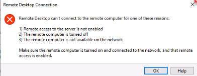

---
wts:
    title: '12 - Secure network traffic'
    module: 'Module 03 - Security, Privacy, Compliance and Trust'
---
# 12 - Secure network traffic

In this walk-through, we will create and configure inbound and outbound security port rules.

Estimated time: 45 minutes

# Task 1: Create a virtual machine

In this task, we will deploy a custom template that creates a virtual machine. 

1. Sign in to the [Azure portal](https://portal.azure.com).

2. Search for and select **Deploy a custom template**.

3. Select **Create a Windows virtual machine**.

4. Complete the template, leaving other settings at their default.

    | Setting | Value |
    | -- | -- |
    | Subscription | **Choose your subscription** |
    | Resource group | **myRGSecure** (create new) |
    | Location | **(US) East US** |
    | Admin username | **azureuser** |
    | Admin password | **Pa$$w0rd1234** |
    | DNS prefix | **myrgsecurexxx** (must be unique) |
    | Windows OS version | 2016-Datacenter |
    | | |

5. Check the box to **Agree with the terms and conditions stated above**. 

6. Click **Purchase**. 

7. Monitor the deployment. It may take a few minutes for the resource group and virtual machine to be created. 

8. From the **Notifications** window, select **Go to resource**. 

9. Select the **SimpleWinVM** virtual machine.

10. Click  **Networking** and then click the name of the Network Interface, **MyVMNic**.

11. Notice that there is no Network security group associated with this network interface.

# Task 2: Create a network security group

In this task, we will create a network security group and associate the network interface.

1. In the portal, search for and select **Network security groups**. 

2. Click **+Add** and complete the form.

    | Setting | Value |
    | -- | -- |
    | Subscription | **Choose your subscription** |
    | Resource group | **myRGSecure** |
    | Name | **myNSGSecure** |
    | Region | **(US) East US**  |
    | | |

3. Click **Review + create** and then after the validation click **Create**.

4. After the NSG is created, **Go to resource**.

5. Under **Settings** click **Network interfaces** and then **+ Associate**.

6. Select **myVMNic** which the network interace for your new virtual machine. 

# Task 3: Configure an inbound security port rule to allow RDP

In this task, we willallow RDP to the virtual machine by configuring an inbound security port rule. 

1. Locate your new virtual machine. 

3. On the **Overview** pane, click **Connect**.

4. Attempt to connect to the virutal machine using RDP. By default the network security group does not allow RDP. Close the error window. 

    

5. Under **Settings**, click on **Networking**, and notice the inbound rules for the **myNSGSecure (attached to network interface: myVMNic)** network security group deny all inbound traffic except traffic within the virtual network, including a load balancer. 

6. Click **Add an Inbound port rule** to the right of the **myNSGSecure (attached to network interface: myVMNic)** network security group. Click **Add** when you are done. 

    | Setting | Value |
    | -- | -- |
    | Source | **Any**|
    | Source port ranges | * |
    | Destination | **Any** |
    | Destination port ranges | **3389** |
    | Protocol | **TCP** |
    | Action | **Allow** |
    | Priority | **300** |
    | Name | **AllowRDP** |
    | | |

7. Wait for the rule to deploy, and then try again to RDP into the virtual machine. This time you should be successful. Remember the user is **azureuser** and the password is **Pa$$w0rd1234**.

# Task 4: Configure an outbound security port rule to deny Internet access

In this task, we will create a NSG outbound port rule that will deny Internet access and then test to ensure the rule is working.

1. Continue in your virtual machine RDP session. 

2. After the machine starts, open an **Internet Explorer** browser. 

3. Verify that you can access https://www.bing.com and then close Internet Explorer. You will need to work through the IE enhanced security pop-ups. 

**Note:** We will now configure a rule to deny outbound internet access. 

4. Return to the portal, locate your virtual machine.

5. Under **Settings**, click **Networking**, and then **Outbound port rules**.

6. Notice there is a rule, **AllowInternetOutbound**. This a default rule and cannot be removed. 

7. Click **Add outbound port rule** to the right of the **myNSGSecure  (attached to network interface: myVMNic)** network security group and configure a new outbound security rule with a higher priority that will deny internet traffic. Click **Add** when you are finished. 

    | Setting | Value |
    | -- | -- |
    | Source | **Any**|
    | Source port ranges | * |
    | Destination | **Service tag** |
    | Destination service tag | **Internet** |
    | Destination port ranges | * |
    | Protocol | **TCP** |
    | Action | **Deny** |
    | Priority | **4000** |
    | Name | **DenyInternet** |
    | | |

8. Return to your RDP session. 

9. Browse to https://www.microsoft.com. The page should not display. You may need to work through additional IE enhanced security pop-ups.  

**Note**: To avoid additional costs, you can remove this resource group. Search for resource groups, click your resource group, and then click **Delete resource group**. Verify the name of the resource group and then click **Delete**. Monitor the **Notifications** to see how the delete is proceeding.

