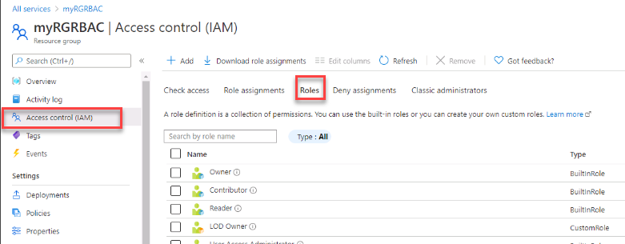

---
wts:
    title: '15 - Manage access with RBAC'
    module: 'Module 03 - Security, Privacy, Compliance and Trust'
---
# 15 - Manage access with RBAC

In this walkthrough, we will assign roles and view activity logs. 

Estimated time: 15 minutes

# Task 1: View and assign roles

In this task, we will assign the Virtual machine contributor role. 

1. Sign in to the [Azure portal](https://portal.azure.com).

2. Search for and select **Resource groups**, then click **+Add**.

3. Create a new resource group. Click **Create** when you are finished. 

    | Setting | Value |
    | -- | -- |
    | Subscription | **Choose your subscription** |
    | Resource group | **myRGRBAC** |
    | Region | **(US) East US** |
    | | |

4. Create **Review + create** and then click **Create**.

5. Click **Go to resources** or **Refresh** the resource group page. 

6. Click on the  **Access control (IAM)** blade, and then click on **Roles**. Scroll through the large number of roles definitions that are available. Use the Informational icons to get an idea of each role's permissions. Notice there is also information on the number of users and groups that are assigned to each role.

    

7. Return to the **Access control (IAM)** page, click on **Role assignments** and then click **+Add**. Assign yourself as a Virtual machine contributor, then click **Save**. 

    | Setting | Value |
    | -- | -- |
    | Role | **Virtual machine contributor** |
    | Assign access to | **Azure AD user, group, or service principal** |
    | Select | **locate yourself** |
    | | |

    **Note:** The Virtual machine contributor role lets you manage virtual machines, but not access to them, and not the virtual network or storage account they're connected to.

    

5. **Refresh** the Role assignments page and ensure you are now listed as a Virtual machine contributor. 

**Note:** As a virtual machine contributor you will be able to manage virtual machines in the resource group. This does not include accessing the machines, or their virtual network or storage accounts. 

# Task 2: Monitor role assignments and remove a role

In this task, we will view the activity log to verify the role assignment, and then remove the role. 

1. In the Azure portal, search for and select **Activity log**.

2. Click **Add filter**, select **Operation**, and then **Create role assignment**.

    

3. Verify the Activity log shows your role assignment. 

4. Can you figure out how to remove your role assignment?

Congratulations! You have assigned roles and viewed activity logs. 

**Note**: To avoid additional costs, you can remove this resource group. Search for resource groups, click your resource group, and then click **Delete resource group**. Verify the name of the resource group and then click **Delete**. Monitor the **Notifications** to see how the delete is proceeding.

