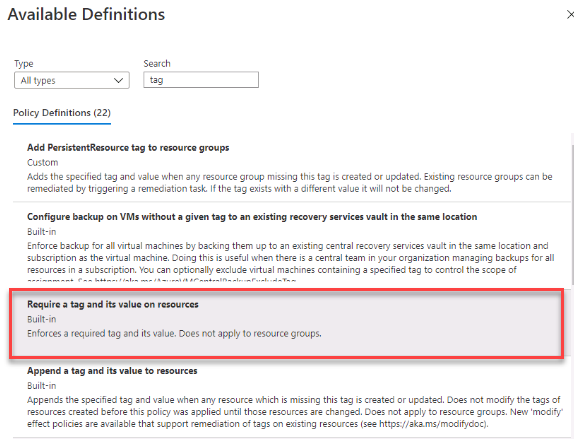

---
wts:
    title: '17 - Implement resource tagging'
    module: 'Module 03 - Security, Privacy, Compliance and Trust'
---
# 17 - Implement resource tagging

In this walkthrough, we will create a policy assignment that requires tagging, created a storage account and test the tagging, view resources with a specified tag, and remove the tagging policy.

Estimated time: 30 minutes

# Task 1: Create a Policy assignment

In this task, we will configure the **Require specified tag** policy and assign it to our subscription. 

1. Sign in to the [Azure portal](https://portal.azure.com).

2. Search for and select **Policy**. 

3. Under the **Authoring** section click **Assignments**, and then select **Assign Policy** from the top of the  page.

4. Notice the **Scope** for our policy will be subscription wide. 

5. Select the **Policy definition** ellipsis button (end of the textbox on the right).  In the **Search** box type **tag** and click on the  **Require specified tag** definition, then click **Select**.

   

6.  In the **Assign policy** pane, in the **PARAMETERS** tab, type in **Company** for the tag name. Cick **Review + create**, and then **Create**.

    **Note:** This is a simple example to demonstrate tagging. 

    

7. The **Require specified tag** policy assignment is now in place. When a subscription resource is created the Company tag value must be supplied.

   

# Task 2: Create a storage account to test the required tagging

In this task, we will create storage accounts to test the required tagging. 

1. In the Azure Portal, search for and select **Storage accounts**, and then click **+Add**.

2. Configure the storage account. 

    | Setting | Value | 
    | --- | --- |
    | Subscription | **Use your subscription** |
    | Resource group | **myRGTags** (new) |
    | Storage account name | **storageaccountxxx** (must be unique) |
    | Location | **(US) East US** |
    | | |

3. Click **Review + create**. 

**Note:** We are testing to see what happens when the tag is not supplied. 

4. You will receive a Validation failed message, and click on the **Click here to view details** message. In the resultant **Errors** blade, on the **Summary** tab note the error message, **Resource was disallowed by Policy**.

    **Note:** If you view the Raw Error tab you will see the specific tag name that is required. 

    

5. Close the **Error** pane and click **Previous** (bottom of the screen). Provide the tagging information. 

    | Setting | Value | 
    | --- | --- |
    | Tag name | **Company** (may not be in the drop-down list) |
    | Tag value | **Contoso** |
    | | |

6. Click **Review + create**, and the validation should now pass. Click **Create** to deploy the storage account. 

# Task 3: View all resources with a specific tag

1. In the Portal, search and select **Tags**.

2. Notice all the tags/values that are available are shown. Select the **Company:Contoso** pair and your storage account will be listed. Your storage account must be deployed for the tag to display. 

   

3. In the Portal, search and select **All resources**.

4. Click **Add filter** and add the **Company** tag. Notice you can limit the search to available values of the tag. With the filter applied your storage account will be listed.

    

# Task 4: Delete the policy assignment

In this task, we will remove the **Require specific tag** policy so it does not affect our future work. 

1. In the portal, search for and select **Policy**, and then click your **Require specified tag** policy.

2. Select **Delete Assignment** from the top menu.

3. Confirm you wish to delete the policy assignment in the **Delete assignment** dialogue by clicking **Yes**

5. As you have time, try to create another resource to ensure the policy is no longer in effect.

In this walkthrough, we created a policy assignment that required tagging, created a storage account and tested the tagging, viewed resources with a specified tag, and removed the tagging policy.

**Note**: To avoid additional costs, you can remove this resource group. Search for resource groups, click your resource group, and then click **Delete resource group**. Verify the name of the resource group and then click **Delete**. Monitor the **Notifications** to see how the delete is proceeding.